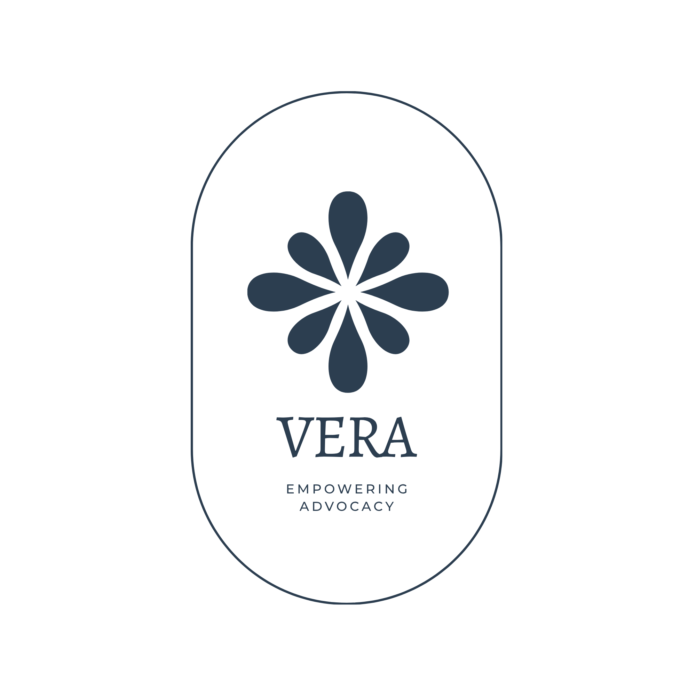

# VERA — Victim Evidence & Response Advocate

[](LICENSE)

**A calm, structured place to start, on the worst day.**

VERA is a free, open-source, browser-based intake workspace that helps crime
victims organize urgent concerns, evidence, and timelines, and prepare a
clean handoff packet for a human advocate to review. No account, no app to
install, nothing to pay for — open the page and start. Built and maintained
by [White Knight Law](https://www.whiteknightlaw.org/), a 501(c)(3)
nonprofit, and live today at
[vera.whiteknightlaw.org](https://vera.whiteknightlaw.org/).

## Overview

Someone who has just experienced a crime is often overwhelmed, unsure what
counts as "evidence," and unsure what to tell an advocate first. VERA is a
guided, chat-style intake that:

- Walks a victim through describing what happened in their own words
- Flags language that suggests an active safety risk and immediately
  surfaces crisis-line / emergency-services guidance
- Helps organize evidence and build a timeline without requiring uploads
- Suggests relevant support resources (drawn from published victim-advocacy
  guidelines in [`resources/`](resources/))
- Packages everything into a structured handoff for a human advocate to
  review — VERA never makes decisions on its own

The whole thing runs client-side as a single static page: no account, no
server-side storage of case data beyond the browser, no dependencies to
install.

## Why we built this

Most victim-advocacy intake still starts with a phone call or a paper form,
at exactly the moment someone is least equipped to organize their thoughts.
That gap — between the moment someone decides to reach out and the moment a
human actually listens — is where people go quiet, give up, or leave out
the detail that mattered most.

White Knight Law built VERA to close that gap. Not to replace an advocate —
to make sure the advocate starts from context instead of a blank page, and
that nothing urgent gets missed in between. It's open source because this
problem is bigger than one organization, and because every advocacy group,
clinic, and hotline that needs something like this should be able to run
it, fork it, and make it their own — for free, forever.

## Part of a larger mission

This repository is the **intake layer** — the first, open-source piece of
a broader White Knight Law initiative called VERA: making legal help
accessible regardless of ability to pay. The long-term vision connects a
victim's initial intake (what's in this repo, live today) to attorney
matching and funded representation, so that someone's worst day doesn't
also become the day the legal system fails them for lack of money.

This repo — the intake tool, its crisis-detection logic, and its handoff
format — is the part that's built, deployed, and open source today. The
attorney-matching and funding side is a separate, non-technical program run
by White Knight Law directly; it isn't part of what this grant funds or
what's in this codebase.

## Impact and mission fit

VERA exists at the intersection of public-interest software and open source:

- **Free forever, by design.** MIT-licensed, no paywall, no account. Any
  advocacy nonprofit, legal aid clinic, or hotline can deploy it as-is or
  fork it for their own population.
- **Built by a nonprofit, for the public interest.** White Knight Law is a
  501(c)(3); VERA isn't a product looking for a business model — it's
  infrastructure for a problem the market doesn't otherwise solve.
- **Small footprint, real use.** A single static page, no backend
  dependencies, already live in production at
  [vera.whiteknightlaw.org](https://vera.whiteknightlaw.org/) — this is a
  working tool, not a proposal.
- **Genuinely open to contribution.** Accessibility, internationalization,
  and resource-referral logic are all real, well-scoped gaps a new
  contributor can pick up — see [CONTRIBUTING.md](CONTRIBUTING.md).

## For reviewers

If you're evaluating this repo (open-source review, contribution program,
etc.), the fastest way to get oriented:

1. Open [`index.html`](index.html) in a browser — no build step, it just
   runs.
2. Read [`docs/whiteknight-dashboard-integration.md`](docs/whiteknight-dashboard-integration.md)
   for how a completed intake hands off to the production system.
3. Check [CONTRIBUTING.md](CONTRIBUTING.md) for how changes are made and
   why the safety/trauma-informed constraints exist.

It's a small, self-contained, actively maintained project with a clear
license, a real (if unconventional) use case, and room for meaningful
contributions — accessibility, copy, and resource-referral logic are all
open areas.

## License

This project is open source, licensed under the [MIT License](LICENSE).

## Contributing

Contributions are welcome — see [CONTRIBUTING.md](CONTRIBUTING.md) for
project layout, local setup, and guidelines specific to working on a
sensitive, trauma-informed tool. Please also read our
[Code of Conduct](CODE_OF_CONDUCT.md).

## Security

Found a vulnerability, especially anything that could expose real case
data? See [SECURITY.md](SECURITY.md) for how to report it privately.

## Project layout

```
index.html   Entire app: markup, CSS, and vanilla JS in one file
docs/        Internal integration notes (e.g. dashboard handoff contract)
resources/   Reference PDFs (victim-advocacy guidelines) surfaced by the app
```
